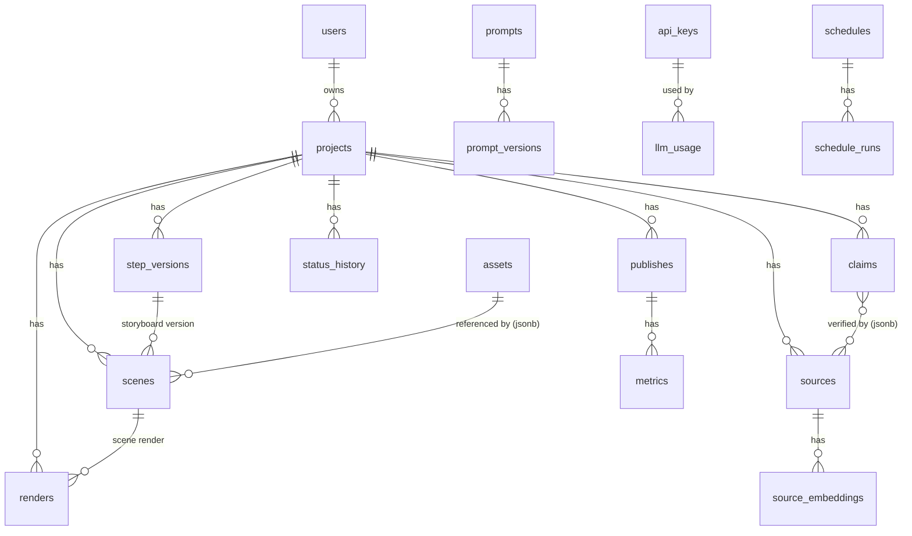

# Database Schema Specification

**Version:** 1.0 · PostgreSQL 16 + pgvector · Migration: Alembic (`backend/alembic/`)
**Đi kèm:** [ARCHITECTURE.md](../ARCHITECTURE.md) §5 · [SRS.md](../SRS.md)

Quy ước chung: PK là `id UUID DEFAULT gen_random_uuid()`; timestamp là `TIMESTAMPTZ`; mọi bảng có `created_at DEFAULT now()`; bảng mutable thêm `updated_at` (trigger). Soft-delete bằng `archived_at` khi cần, không DELETE dữ liệu người dùng.

---

# 1. ERD



---

# 2. DDL

## 2.1 Auth & RBAC

```sql
CREATE TABLE users (
    id            UUID PRIMARY KEY DEFAULT gen_random_uuid(),
    email         CITEXT UNIQUE NOT NULL,
    password_hash TEXT NOT NULL,                 -- argon2id
    display_name  TEXT NOT NULL,
    role          TEXT NOT NULL DEFAULT 'creator'
                  CHECK (role IN ('admin', 'creator')),
    is_active     BOOLEAN NOT NULL DEFAULT true,
    created_at    TIMESTAMPTZ NOT NULL DEFAULT now(),
    updated_at    TIMESTAMPTZ NOT NULL DEFAULT now()
);

CREATE TABLE refresh_tokens (
    id         UUID PRIMARY KEY DEFAULT gen_random_uuid(),
    user_id    UUID NOT NULL REFERENCES users(id) ON DELETE CASCADE,
    token_hash TEXT NOT NULL,
    expires_at TIMESTAMPTZ NOT NULL,
    revoked_at TIMESTAMPTZ,
    created_at TIMESTAMPTZ NOT NULL DEFAULT now()
);
CREATE INDEX idx_refresh_tokens_user ON refresh_tokens(user_id) WHERE revoked_at IS NULL;
```

## 2.2 Project & State

```sql
CREATE TABLE projects (
    id          UUID PRIMARY KEY DEFAULT gen_random_uuid(),
    owner_id    UUID NOT NULL REFERENCES users(id),
    name        TEXT NOT NULL,
    topic       TEXT NOT NULL,
    mode        TEXT NOT NULL DEFAULT 'interactive'
                CHECK (mode IN ('interactive', 'daily_news')),
    status      TEXT NOT NULL DEFAULT 'DRAFT'
                CHECK (status IN ('DRAFT','RESEARCHING','NEED_REVIEW','REVISING',
                                  'APPROVED','PRODUCING','RENDERING','READY',
                                  'PUBLISHING','PUBLISHED','FAILED','ARCHIVED')),
    language    TEXT NOT NULL DEFAULT 'vi',
    formats     TEXT[] NOT NULL DEFAULT '{vertical_1080x1920}',
    cloned_from UUID REFERENCES projects(id),
    archived_at TIMESTAMPTZ,
    created_at  TIMESTAMPTZ NOT NULL DEFAULT now(),
    updated_at  TIMESTAMPTZ NOT NULL DEFAULT now()
);
CREATE INDEX idx_projects_owner_status ON projects(owner_id, status) WHERE archived_at IS NULL;
CREATE INDEX idx_projects_updated ON projects(updated_at DESC);

CREATE TABLE status_history (
    id          BIGINT GENERATED ALWAYS AS IDENTITY PRIMARY KEY,
    project_id  UUID NOT NULL REFERENCES projects(id) ON DELETE CASCADE,
    from_status TEXT NOT NULL,
    to_status   TEXT NOT NULL,
    actor       TEXT NOT NULL,          -- user uuid | 'system' | agent name
    reason      TEXT,
    created_at  TIMESTAMPTZ NOT NULL DEFAULT now()
);
CREATE INDEX idx_status_history_project ON status_history(project_id, created_at DESC);
```

Chuyển trạng thái chỉ qua service `ProjectStateMachine` (application layer) — bảng CHECK không thể enforce cạnh hợp lệ; unit test bắt buộc cover ma trận chuyển.

## 2.3 Versioning

```sql
CREATE TABLE step_versions (
    id             UUID PRIMARY KEY DEFAULT gen_random_uuid(),
    project_id     UUID NOT NULL REFERENCES projects(id) ON DELETE CASCADE,
    step           TEXT NOT NULL
                   CHECK (step IN ('research','outline','script','storyboard','scene_set')),
    version        INT NOT NULL,
    parent_version INT,                 -- version của step TRƯỚC mà version này sinh từ
    content        JSONB NOT NULL,      -- schema thực thi ở Pydantic theo step
    stale          BOOLEAN NOT NULL DEFAULT false,
    created_by     TEXT NOT NULL,       -- user uuid | 'ai'
    created_at     TIMESTAMPTZ NOT NULL DEFAULT now(),
    UNIQUE (project_id, step, version)
);
CREATE INDEX idx_step_versions_lookup ON step_versions(project_id, step, version DESC);
```

`content` theo step: `research` = danh sách source id + summary; `outline`/`script` = document; `storyboard` = scene list metadata; `scene_set` = mảng Scene JSON đầy đủ. "Version hiện hành" = version lớn nhất không stale.

## 2.4 Research & Fact Check

```sql
CREATE TABLE sources (
    id              UUID PRIMARY KEY DEFAULT gen_random_uuid(),
    project_id      UUID REFERENCES projects(id) ON DELETE CASCADE,  -- NULL = cache dùng chung
    url             TEXT NOT NULL,
    url_hash        TEXT NOT NULL,               -- sha256(normalized url) — dedupe
    title           TEXT,
    author          TEXT,
    published_at    TIMESTAMPTZ,
    fetched_at      TIMESTAMPTZ NOT NULL DEFAULT now(),
    summary_vi      TEXT,
    content         TEXT,                        -- full text đã extract
    content_hash    TEXT,
    provider        TEXT NOT NULL,               -- arxiv|hn|github|rss|searxng|manual...
    partial_content BOOLEAN NOT NULL DEFAULT false,
    trusted         BOOLEAN NOT NULL DEFAULT false,  -- thuộc danh sách nguồn tin cậy
    pinned          BOOLEAN NOT NULL DEFAULT false,
    disabled        BOOLEAN NOT NULL DEFAULT false
);
CREATE UNIQUE INDEX idx_sources_dedupe ON sources(project_id, url_hash);
CREATE INDEX idx_sources_shared_cache ON sources(url_hash) WHERE project_id IS NULL;

CREATE TABLE source_embeddings (
    source_id UUID PRIMARY KEY REFERENCES sources(id) ON DELETE CASCADE,
    embedding vector(1024) NOT NULL             -- BGE-M3
);
CREATE INDEX idx_source_embeddings_hnsw ON source_embeddings
    USING hnsw (embedding vector_cosine_ops);

CREATE TABLE claims (
    id          UUID PRIMARY KEY DEFAULT gen_random_uuid(),
    project_id  UUID NOT NULL REFERENCES projects(id) ON DELETE CASCADE,
    claim_text  TEXT NOT NULL,
    claim_type  TEXT NOT NULL,     -- model_name|benchmark|release_date|paper|github|version|other
    verdict     TEXT NOT NULL CHECK (verdict IN ('PASS','WARN','FAIL','PENDING')),
    evidence    JSONB NOT NULL DEFAULT '[]',
                -- [{source_id, quote, supports: true|false}]
    created_at  TIMESTAMPTZ NOT NULL DEFAULT now()
);
CREATE INDEX idx_claims_project ON claims(project_id, verdict);
```

Verdict tổng của project = FAIL nếu ∃ FAIL; WARN nếu ∃ WARN; PASS nếu tất cả PASS.

## 2.5 Scene, Asset, Render

```sql
CREATE TABLE scenes (
    id                 UUID PRIMARY KEY DEFAULT gen_random_uuid(),  -- = scene_id trong JSON
    project_id         UUID NOT NULL REFERENCES projects(id) ON DELETE CASCADE,
    scene_set_version  INT NOT NULL,          -- FK logic tới step_versions(scene_set)
    scene_number       INT NOT NULL,
    scene_json         JSONB NOT NULL,
    schema_version     TEXT NOT NULL,
    content_hash       TEXT NOT NULL,          -- cache key thành phần (xem scene-json-schema §1.2)
    dirty              BOOLEAN NOT NULL DEFAULT true,
    updated_at         TIMESTAMPTZ NOT NULL DEFAULT now(),
    UNIQUE (project_id, scene_set_version, scene_number)
);
CREATE INDEX idx_scenes_lookup ON scenes(project_id, scene_set_version);

CREATE TABLE assets (
    id                   UUID PRIMARY KEY DEFAULT gen_random_uuid(),
    provider             TEXT NOT NULL,        -- pexels|pixabay|unsplash|local_sd|user_upload
    source_url           TEXT,
    license              TEXT NOT NULL,        -- KHÔNG cho phép rỗng (FR-20)
    attribution_required BOOLEAN NOT NULL DEFAULT false,
    attribution_text     TEXT,
    media_type           TEXT NOT NULL CHECK (media_type IN ('image','video','audio')),
    content_hash         TEXT NOT NULL UNIQUE, -- dedupe
    storage_path         TEXT NOT NULL,        -- assets/{hash}.{ext} trên MinIO
    width                INT, height INT, duration_ms INT,
    uploaded_by          UUID REFERENCES users(id),
    created_at           TIMESTAMPTZ NOT NULL DEFAULT now()
);

CREATE TABLE renders (
    id           UUID PRIMARY KEY DEFAULT gen_random_uuid(),
    project_id   UUID NOT NULL REFERENCES projects(id) ON DELETE CASCADE,
    scene_id     UUID REFERENCES scenes(id),   -- NULL = job merge toàn video
    kind         TEXT NOT NULL CHECK (kind IN ('scene','merge')),
    format       TEXT NOT NULL,
    status       TEXT NOT NULL DEFAULT 'queued'
                 CHECK (status IN ('queued','running','done','failed','cache_hit')),
    cache_key    TEXT,
    output_path  TEXT,
    worker_id    TEXT,
    error        TEXT,
    duration_ms  INT,                          -- thời gian render thực
    created_at   TIMESTAMPTZ NOT NULL DEFAULT now(),
    finished_at  TIMESTAMPTZ
);
CREATE INDEX idx_renders_project ON renders(project_id, created_at DESC);
CREATE UNIQUE INDEX idx_renders_cache ON renders(cache_key) WHERE status = 'done';
```

## 2.6 Publish & Analytics

```sql
CREATE TABLE publishes (
    id           UUID PRIMARY KEY DEFAULT gen_random_uuid(),
    project_id   UUID NOT NULL REFERENCES projects(id) ON DELETE CASCADE,
    platform     TEXT NOT NULL CHECK (platform IN ('download','youtube','tiktok','facebook','linkedin')),
    status       TEXT NOT NULL DEFAULT 'pending'
                 CHECK (status IN ('pending','scheduled','uploading','published','failed')),
    external_id  TEXT,                          -- video id trên nền tảng
    external_url TEXT,
    title        TEXT, description TEXT, tags TEXT[],
    ai_disclosed BOOLEAN NOT NULL DEFAULT true,
    scheduled_at TIMESTAMPTZ,
    published_at TIMESTAMPTZ,
    error        TEXT,
    created_at   TIMESTAMPTZ NOT NULL DEFAULT now()
);

CREATE TABLE metrics (
    id          BIGINT GENERATED ALWAYS AS IDENTITY,
    publish_id  UUID NOT NULL REFERENCES publishes(id) ON DELETE CASCADE,
    platform    TEXT NOT NULL,
    metric      TEXT NOT NULL,   -- view|like|comment|watch_time_s|completion_rate|ctr
    value       NUMERIC NOT NULL,
    metric_date DATE NOT NULL,
    source      TEXT NOT NULL CHECK (source IN ('api','manual')),
    created_at  TIMESTAMPTZ NOT NULL DEFAULT now(),
    PRIMARY KEY (id, metric_date)
) PARTITION BY RANGE (metric_date);
-- partition theo tháng, tạo tự động bằng pg_partman hoặc migration định kỳ
CREATE UNIQUE INDEX idx_metrics_dedupe ON metrics(publish_id, metric, metric_date, source);
```

## 2.7 Prompt, API Key, Usage, Schedule

```sql
CREATE TABLE prompts (
    id     UUID PRIMARY KEY DEFAULT gen_random_uuid(),
    name   TEXT UNIQUE NOT NULL      -- 'research.summarize', 'script.generate'...
);

CREATE TABLE prompt_versions (
    id          UUID PRIMARY KEY DEFAULT gen_random_uuid(),
    prompt_id   UUID NOT NULL REFERENCES prompts(id) ON DELETE CASCADE,
    version     INT NOT NULL,
    template    TEXT NOT NULL,        -- jinja2, biến khai báo trong variables
    variables   TEXT[] NOT NULL DEFAULT '{}',
    is_active   BOOLEAN NOT NULL DEFAULT false,   -- đúng 1 active / prompt
    created_by  UUID REFERENCES users(id),
    created_at  TIMESTAMPTZ NOT NULL DEFAULT now(),
    UNIQUE (prompt_id, version)
);
CREATE UNIQUE INDEX idx_prompt_active ON prompt_versions(prompt_id) WHERE is_active;

CREATE TABLE api_keys (
    id              UUID PRIMARY KEY DEFAULT gen_random_uuid(),
    provider        TEXT NOT NULL,    -- gemini|groq|openrouter|tavily|pexels|fpt...
    label           TEXT NOT NULL,
    key_encrypted   BYTEA NOT NULL,   -- Fernet(FERNET_MASTER_KEY)
    status          TEXT NOT NULL DEFAULT 'active'
                    CHECK (status IN ('active','exhausted','revoked','invalid')),
    usage_count     BIGINT NOT NULL DEFAULT 0,
    last_used_at    TIMESTAMPTZ,
    exhausted_until TIMESTAMPTZ,      -- tự re-activate sau reset quota
    created_at      TIMESTAMPTZ NOT NULL DEFAULT now()
);
CREATE INDEX idx_api_keys_provider ON api_keys(provider, status);

CREATE TABLE llm_usage (
    id            BIGINT GENERATED ALWAYS AS IDENTITY,
    provider      TEXT NOT NULL,
    model         TEXT NOT NULL,
    api_key_id    UUID REFERENCES api_keys(id),
    task          TEXT NOT NULL,      -- node/agent name
    tier          TEXT NOT NULL,      -- cheap|strong|embedding
    project_id    UUID,
    tokens_in     INT NOT NULL,
    tokens_out    INT NOT NULL,
    cost_estimate NUMERIC(10,6) NOT NULL DEFAULT 0,
    latency_ms    INT,
    success       BOOLEAN NOT NULL,
    created_at    TIMESTAMPTZ NOT NULL DEFAULT now(),
    PRIMARY KEY (id, created_at)
) PARTITION BY RANGE (created_at);   -- partition theo tháng

CREATE TABLE schedules (
    id         UUID PRIMARY KEY DEFAULT gen_random_uuid(),
    type       TEXT NOT NULL,        -- mode1_pipeline|analytics_collect|publish|cleanup
    cron       TEXT NOT NULL,
    enabled    BOOLEAN NOT NULL DEFAULT false,
    config     JSONB NOT NULL DEFAULT '{}',   -- topic template, platform, gate mode...
    created_at TIMESTAMPTZ NOT NULL DEFAULT now()
);

CREATE TABLE schedule_runs (
    id          BIGINT GENERATED ALWAYS AS IDENTITY,
    schedule_id UUID NOT NULL REFERENCES schedules(id) ON DELETE CASCADE,
    started_at  TIMESTAMPTZ NOT NULL DEFAULT now(),
    finished_at TIMESTAMPTZ,
    status      TEXT NOT NULL DEFAULT 'running'
                CHECK (status IN ('running','success','failed')),
    project_id  UUID,
    error       TEXT,
    cost        NUMERIC(10,6),
    PRIMARY KEY (id, started_at)
) PARTITION BY RANGE (started_at);
```

---

# 3. Quy tắc vận hành schema

1. **Mọi thay đổi qua Alembic migration** — không sửa tay DB. Migration phải reversible (`downgrade` viết thật, không `pass`).
2. Partition mới cho `llm_usage` / `metrics` / `schedule_runs` tạo trước 1 tháng (schedule `cleanup` đảm nhận).
3. JSONB (`step_versions.content`, `scenes.scene_json`) validate ở Pydantic trước khi ghi — DB không CHECK nội dung JSON.
4. Backup: pg_dump daily + WAL archiving (xem [runbook.md](../runbook.md)).
5. Seed bắt buộc khi khởi tạo: admin user đầu tiên (env `ADMIN_EMAIL`/`ADMIN_PASSWORD`), bộ prompt mặc định (từ [prompts.md](prompts.md)), danh sách domain `trusted` mặc định.
